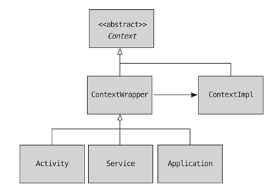

# Android Context

You will always encounter the Context class when developing an app.  
Context is very important concept in android development.  
Without Context, you cannot start an activity, broadcast, or service.  
Context is the superclass of many components, and it connects many components through Context.

So understanding Context itself is helpful in understanding the components.
Various components(Activity, Service, Broadcast Receiver, Content Provider) are able to access
system services and application resources through Context.

## What is Android Context?

Context provides information about the current state of the application.  
Context is the interface that allows access to application-specific resources and system service,
and application environment.

The main features are:

* access resource: getResources(), getString(), getDrawable() etc.
* access system service: getSystemService() etc.
* start intent: startActivity(), startService() etc.
* layout inflation: transform XML layout to View using LayoutInflater.

## Context and its subclasses

`Context` is an abstract class.  
`ContextWrapper` and `ContextImpl` extends `Context` class. and ContextWrapper has a reference to
`ContextImpl`.    
`Activity`, `Service`, `Application` are concrete implementation of `ContextWrapper`.  
  
this diagram shows the relationship between `Context`, `ContextWrapper`, and `ContextImpl`.

## You can use multiple ways to use Context

There are multiple ways to get a Context instance.  
For example, in Activity, you can use:

1. `this` (activity instance itself)
2. `getBaseContext()` to get a ContextImpl instance
3. `getApplicationContext()` to get an Application instance

## Application Context VS Activity Context

|                   | Application Context                | Activity Context                                     |
|-------------------|------------------------------------|------------------------------------------------------|
| Lifecycle         | Tied to the application            | Tied to the specific Activity                        |
| Usage Scope       | Global                             | Specific to the Activity                             |
| UI Interaction    | Not suitable                       | Suitable                                             |
| Memory Leak Risk  | Low                                | High (if improperly managed)                         |
| Example Use Cases | Singleton objects such as Database | `Dialogs`, `Snackbar`, Managing views and animations |

Using Application Context where Activity Context is required may cause unexpected behavior or
crashes.

```kotlin
// This works with Application Context
Toast.makeText(getApplicationContext(), "Hello!", Toast.LENGTH_SHORT).show()

// This fails with Application Context
AlertDialog.Builder(getApplicationContext())
    .setTitle("Title")
    .setMessage("Message")
    .show() // Will cause an exception

```

## Common Pitfalls: Context Misuse

1. Leaking Activity Context
   Avoid holding a reference to a Activity Context in a static variable or singleton,  
   as this prevents the Activity from being garbage collected.

   Example of Bad Practices:

   ```kotlin
   object Singleton {
       var context: Context? = null
   }
   Singleton.context = this // Memory leak!
   ```

   Solution: Use Application Context instead:

   ```kotlin
   Singleton.context = applicationContext
   ```

2. Using Application Context for UI Tasks
   Application Context cannot handle certain UI tasks, such as inflating layouts or displaying
   dialogs.

3. Directly Instantiating Context
   Context is a system-managed class and cannot be directly instantiated.

4. Using Incorrect Context for Views
   Ensure the proper Context is passed when creating or inflating views.

   Example of Bad Practice:
   ```kotlin
   val view = LayoutInflater.from(applicationContext).inflate(R.layout.activity_main, null)
   // May cause incorrect behavior due to missing Activity-specific attributes
   ```

   Solution:
   ```kotlin
   val view = LayoutInflater.from(this).inflate(R.layout.activity_main, null)
   ``` 

## Conclusion

Understanding and correctly using Context is vital for creating efficient and memory-safe Android
applications.  
Choosing the right Context for the right task -

* Application Context for global operations
* Activity Context for UI-related tasks
  is a key to avoiding pitfalls like memory leaks and incorrect behavior.

### Key Takeaways:

* Understand the lifecycle and scope of different Context types.
* Use the Application Context for tasks that span the entire application.
* Use Activity Context for tasks specific to the UI or Activity lifecycle.
* Avoid common mistakes like holding static references to Activity Context.

With proper Context usage, your Android applications will be more robust, efficient, and
maintainable.

## Reference

- Android Developer - [Context](https://developer.android.com/reference/android/content/Context)
- Book: 안드로이드 프로그래밍 Next Step - 노재춘


