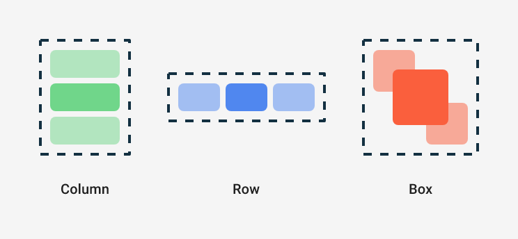

```kotlin
class BasicComposeActivity : ComponentActivity() {
    override fun onCreate(savedInstanceState: Bundle?) {
        super.onCreate(savedInstanceState)
        setContent {
            LearningTestTheme {
                Surface(
                    modifier = Modifier.fillMaxSize(),
                    color = MaterialTheme.colorScheme.background,
                ) {
                    Greeting("Android")
                }
            }
        }
    }
}
```

You use `setContent` to define your layout,  
but instead of using an XML file as you'd do in the traditional View system(like
`setContentView`),  
you call Composable functions within it.

`LearningTestTheme` is a way to style Composable functions.([Theme.kt](../../../ui/theme/Theme.kt))

Surface

You can set a different background color for the `Greeting` by wrapping the Text composable with a
`Surface`.  
Surface takes a color, so use `MaterialTheme.colorScheme.primary`

The components nested inside `Surface` will be drawn on top of that background color.
[GreetingV2.kt](GreetingV2.kt): `GreetingV2` use `Surface`.

Look at the text color.  
The text is now white even we didn't define it.

The Material Components such as `androidx.compose.material3.Surface`, are built to make your
experience better  
by taking taking care of common features that you probably want in your app,  
such as choosing an appropriate color for text.

We say **Material is opinionated** because it provides good defaults and patterns that are common to
most apps.  
The Material components in Compose are built ont top of other foundational components (in
`androidx.compose.foundation`),  
which are also accessible from your app components in case you need more flexibility.

In this case, `Surface` understands that, when the background is set to the `primary` color,  
any text on top of it should use the `onPrimary` color, which is also defined in the theme.

## Modifier

Most Compose Ui elements such as `Surface` and `Text` accept an **optional modifier parameter**.  
`Modifier`s tell a UI element how to lay out, display, or behave within its parent layout.

For example, the padding modifier will apply an amount of space around the element it decorates.    
You can create a padding modifier with `Modifier.padding()`.    
You can also add multiple modifiers by chaining them,  
so in our case we can add the padding modifier to the default one: `modifier.padding(24.dp)`.

Now, add padding to your Text on the screen: [GreetingV3.kt](GreetingV3.kt): GreetingV3 use
`Modifier.padding()` and `Surface`.

Modifiers allow you to decorate or augment a composable. Modifiers let you do these sorts of things:

* Change the `composable`'s size, layout, behavior, and appearance
* Add information, like accessibility labels
* Process user input
* Add high-level interactions, like making an element clickable, scrollable, draggable, or zoomable

## Reusing composables

By making small reusable components it's easy to build up a library of UI elements used in your
app.  
Each one is responsible for one small part of the screen and can be edited independently.

As a best practice, ur function should include a Modifier parameter that is assigned an empty
Modifier by default.  
Forward this modifier to the first composable you call inside your function.  
This way, the calling site can adapt instructions and behaviors from outside of your composable
function.

Create a Composable called MyApp that includes the greeting.

[BasicComposeActivity.kt](../../../BasicComposeActivity.kt)
and [GreetingV3Preview.kt](GreetingV3.kt) reuse `MyApp` composable function.

잘 이해가 안 가는데 조금 이따 또 있는 거 확인하기.

## Columns and Rows

The three basic standard layout elements in Compose are `Column`, `Row` and `Box`.  


They are Composable functions that take Composable content, so you can place items inside.  
For example, each child inside of a `Column` will be placed vertically.

[GreetingV4.kt](GreetingV4.kt): use `Column`.

Composable functions can be used like any other functions in Kotlin.    
This makes building UIs powerful since you can add statements to influence how the UI will be
displayed.  
For example, you can use a `for` loop to add elements to the
`Column`: [BasicComposeActivity.kt](../../../BasicComposeActivity.kt): just like `MyApp2`

[Column's children Test](../../../../../../../../androidTest/java/com/example/learningtest/compose/basic/codelab/GreetingV4KtTest.kt):
use `onParent`.  
if it has only one composable layout, you can use `Modifier.testTag(...)`.

https://developer.android.com/develop/ui/compose/modifiers

### Add ElevatedButton

[GreetingV5.kt](GreetingV5.kt)
The `Column` is part of a Row, which contains:

* The Column (with `Modifier.weight(1f)`).
* An `ElevatedButton` (with no weight
  applied).[ElevatedButton Reference](https://m3.material.io/components/buttons/overview)

Effect of weight(1f) on the Column:

* The Column is instructed to take up all remaining horizontal space in thr `Row` after the
  `ElevatedButton` is measured and laid out.
* Since the `ElevatedButton` doesn't have a weight, it only takes up as much space as it needs to
  display its content (`Text("Show more")`).

The `Column` expands to fill all available space not occupied by the `ElevatedButton`.  
There's no `alignEnd` modifier so, instead, you give some `weight` to the composable at the start.

[GreetingV5.kt](GreetingV5.kt) 에 대해서 테스트를 아래처럼 해보았다.

```kotlin
@Test
fun greetingV5_row_has_two_children() {
    // given && when
    composeTestRule.setContent {
        GreetingV5(name = "Android")
    }

    composeTestRule.onRoot()
        .onChildren()
        .assertCountEquals(1) // row

    composeTestRule.onRoot()
        .onChildren().onFirst() // Surface -> Row
        .onChildren() // Children of the Row
        .assertCountEquals(2) // Column, ElevatedButton
}
```

그런데 실패함.

나는 Surface 의 children.onFirst 가 이 Row, 그의 children 은 column 과 ElevatedButton 이라고 생각했다.  
그런데 실제로는 assertCountEquals 를 Column 의 children 을 모두 세는 것을 확인했다.

위를 통해 컴포즈를 그릴 때 Row 와 Column 의 레이아웃 중첩이 실제로 코틀린 컴포저블 코드대로 만들어지지 않고, 병합되는 것 같다.

[참고할 만한 것](https://kotlinworld.com/506)
일반적으로 Row·Column 같은 레이아웃 컨테이너는 “시각적 배치” 역할만 하고, 별도의 세멈틱 정보를 갖지 않으면 머지된 트리에서 생략(혹은 다른 노드와 합쳐져 버림)될 수
있습니다.
다시 말해, Row 자신이 별도의 세멈틱 노드로 잡히려면 다음과 같은 작업이 필요합니다.

Modifier.semantics { ... } 를 사용해 Row에 명시적인 세멈틱을 부여하거나,
Modifier.testTag("RowTag") 같이, 테스트 태그를 달아서 “이 노드는 테스트에서 따로 필요한 노드다”라고 표시하거나,
Row가 무언가 접근성(탭 이동) 등이 필요한 경우에 한해 세멈틱 노드로 노출되는 경우가 있음.
즉, 단순 레이아웃인 Row나 Column이 별도로 “보여야 한다”는 의도가 있으면 직접 “이 Row를 세멈틱 트리에 포함시켜 달라”는 정보를 줘야 합니다.

위 한국어로 쓴 내용을 영어로 하면

I wrote a test code for [GreetingV5.kt](GreetingV5.kt) like below.

```kotlin
composeTestRule.onRoot()
    .onChild() // Surface
    .onChildren() // Row
    .assertCountEquals(1)
```

But it failed.

```
Reason: Expected '2' nodes but found '3' nodes that satisfy: ((((isRoot).children)[0]).children)
Nodes found:
1) Node #5 at (l=84.0, t=137.0, r=168.0, b=180.0)px
Text = '[Hello]'
Actions = [SetTextSubstitution, ShowTextSubstitution, ClearTextSubstitution, GetTextLayoutResult]
Has 2 siblings
2) Node #6 at (l=84.0, t=180.0, r=209.0, b=223.0)px
Text = '[Android]'
Actions = [SetTextSubstitution, ShowTextSubstitution, ClearTextSubstitution, GetTextLayoutResult]
Has 2 siblings
3) Node #7 at (l=684.0, t=148.0, r=996.0, b=253.0)px
Focused = 'false'
Role = 'Button'
Text = '[Show more]'
Actions = [OnClick, RequestFocus, SetTextSubstitution, ShowTextSubstitution, ClearTextSubstitution, GetTextLayoutResult]
MergeDescendants = 'true'
```

I expected that the children of the `Row` are `Column` and `ElevatedButton`.  
But actually, the `assertCountEquals` counts all children of the Column.

I think that the layout of Row and Column is merged in the actual Compose tree, not nested as in the
Kotlin Composable code.

Basically, layout containers like Row and Column only play a "visual arrangement" role, and if they
do not have separate semantic information, they can be omitted (or merged with other nodes) in the
merged tree.  
In other words, if Row itself is to be held as a separate semantic node, the following actions are
required.

* Give explicit semantics to Row using Modifier.semantics { ... } or
* Mark it with a test tag like Modifier.testTag("RowTag") to indicate that "this node is a node that
  is needed separately in the test" or
* Row is exposed as a semantic node only when it requires something like accessibility (tab
  movement).

That is, if Row or Column is to be displayed separately, you must provide information that says "
Include this Row in the semantic tree" directly.

[`GreetingV5WithTestTag` or `GreetingV5WithSemantic` function](GreetingV5.kt) has a test tag for the
Row and Column.  
Now i can test the Row and Column separately.

So, this is it?  
It is not very good to add The code only for the test code.  
How did we test the traditional View system using xml?  
There are several ways to manage these identifiers, but it was generally considered easiest to get
them through ID (view identifier).  
reference: https://developer.android.com/training/testing/espresso/basics#finding-view

```kotlin
onView(allOf(withId(R.id.my_view), withText(“ Hello !“)))
```

Setting an identifier in the View system was not awkward because it was used in various situations,
but Compose is designed declaratively, so the need to create identifiers is less felt, so it may be
natural to experience this inconvenience.

## State in Compose

ElevatedButton has content parameter as composable trailing lambda.

```kotlin
var expanded: Boolean = false
ElevatedButton(
    onClick = { expanded = !expanded }
) {
    Text(if (expanded) "Show less" else "Show more")
}
```

This doesn't work as expected.  
Setting a different value for the `expanded` variable won't make Compose detect it as a state change
so nothing will happen.

Compose apps transform data into UI by calling composable functions.  
If your data changes, Compose re-executes these functions with the new data, creating an updated
UI—this is called recomposition.  
Compose also looks at what data is needed by an individual composable so that it only needs to
recompose components whose data has changed and skip recomposing those that are not affected.

The reason why mutating this variable does not trigger recompositions is that it's not being tracked
by Compose. Also, each time Greeting is called, the variable will be reset to false.

To add internal state to a composable, you can use the mutableStateOf function, which makes Compose
recompose functions that read that State.  
State and MutableState are interfaces that hold some value and trigger UI updates (recompositions)
whenever that value changes.  

However you can't just assign mutableStateOf to a variable inside a composable.  
As explained before, recomposition can happen at any time which would call the composable again, resetting the state to a new mutable state with a value of false.

Composable functions can execute frequently and in any order,  
you must not rely on the ordering in which the code is executed, 
or on how many times this function will be recomposed.  

To preserve state across recompositions, remember the mutable state using `remember`.  

```kotlin
val expanded = remember { mutableStateOf(false) }
```

Note that if you call the same composable from different parts of the screen you will create different UI elements,  
each with its own version of the state.  
You can think of internal state as a private variable in a class.

The composable function will automatically be "subscribed" to the state.  
If the state changes, composables that read these fields will be recomposed to display the updates.

You don't need to remember extraPadding against recomposition because it's doing a simple calculation.


https://developer.android.com/codelabs/jetpack-compose-basics#5

