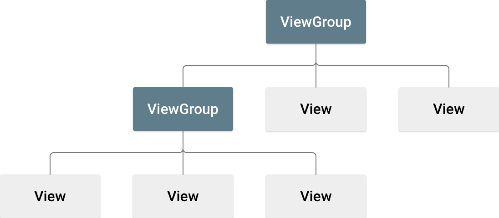

# Compose-Introduction

## What is Compose?

Jetpack Compose is Google's modern toolkit for building Android UIs.  
Its introduction was driven by the limitation of the traditional Android UI framework,  
which relied heavily on XML layouts and View hierarchies.

Traditional Android View System Hierarchy

Compose transforms state into UI elements, via:

## Why Compose was introduced?

Historically, an Android view hierarchy has been representable as a tree of UI widgets.

### Problems with the Traditional Android View System

1. Separation of XML and Kotlin Code
    * Developers need to write UI layouts in XML and handle logic iin Kotlin/Java.
    * This dual-code structure created inconsistencies and required constant syncing between XML and
      Kotlin.
2. UI Debugging Challenges
    * Debugging UI bugs was difficult due to the separation of layout and logic.
    * Issues in the XML layout or View hierarchy could be hard to trace.
3. Low Reusability
    * Views were tightly coupled with Activities or Fragments.
    * Reusability or UI components was limited, requiring repetitive code.
4. Performance Bottlenecks
    * The traditional View hierarchy relied on a deep tree structure, which affected performance in
    * complex UIs.
    * So, rendering large or deeply nested layouts could cause slowdowns.
5. Legacy and Complexity
    * The traditional View system was build on years of legacy code.
    * It relied heavily on inheritance, leading to less flexibility and more complicated code.

### What Jetpack Compose Brings

Jetpack Compose was introduced to solve these problem by rethinking how UIs are built.

1. Kotlin-based UI
    * Compose eliminated the need for XML.
    * UIs are build directly in Kotlin code.
    * [BasicButton.kt](BasicButton.kt)
2. Composition Over Inheritance
    * Traditional Android relied on inheritance (e.g. TextView, Button extended View).
    * Compose uses composition, where UIs are built by combining smaller reusable pieces called
      `Composable`.
    * [BasicProfileCard.kt](BasicProfileCard.kt): The `Text` Composable is composed in
      `BasicProfileCard`.
3. Improved Performance
    * Compose uses a flat hierarchy and avoids the deep tree structure of traditional Views.
    * This leads to better performance, especially for complex or dynamic UIs.
4. Declarative UI Programming
    * Compose introduces a declarative approach,  
      where you **describe "what"' the UI should look like**, **not "how" to build it.**
    * The UI automatically updates when the state changes.  
    * Composable functions could be run in parallel.
    * Composable functions can execute in any order.
    * [BasicDeclarativeCount.kt](BasicDeclarativeCount.kt): The `Text` Composable updates
      automatically when the `count` state changes.
5. Simplified UI Debugging
    * Since the UI and logic are in the same Kotlin file, debugging is much easier.
    * Tools like Android Studio Preview let you see UI changes in real time.
6. Improved Reusability
    * Composable can be easily reused across different screens or projects.
    * [BasicReusingComposable.kt](BasicReusingComposable.kt): The `BasicCard` Composable is reused
      in
      `BasicReusable

## Advantages of Jetpack Compose

1. Easier Learning Curve
    * By removing the need for XML, you only need to learn Kotlin to build UIs.
2. Real-time Previews
    * Android Studio allows you to see Compose UIs in a **preview** without running the app.
    * You can even test with **interactive Mode**.
3. Cleaner Code
    * Compose leads to more concise and readable code, reducing the chances of errors.
4. State Management
    * With Compose, managing UI state is simpler and built into the framework (`remember`,
      `mutableStateOf`).
5. No Legacy Code
    * Compose is designed with modern Android development in mind, avoiding the complexities of
      legacy Views.

## Key Concepts for first-time Compose Users

If you're new to Jetpack Compose, here are some key concepts to get you started:

1. Composable Functions
    * Functions annotated with `@Composable` define UI elements.
2. State Management
    * Use remember and `mutableStateOf` to manage UI state.
    * [BasicDeclarativeCount.kt](BasicDeclarativeCount.kt)
3. Layouts
    * Use Compose's layout containers like `Row`, `Column`, and `Box` instead of XML layouts.
    * [BasicReusingComposable.kt](BasicReusingComposable.kt)
4. Modifiers
    * `Modifier` is used to style and position Composables.
    * [BasicReusingComposable.kt](BasicReusingComposable.kt)
5. Themes
    * Compose supports theming for consistent styling.
    * [Theme.kt](../../../learningtest/ui/theme/Theme.kt)

## Conclusion

Jetpack Compose is a game-changer for Android UI development.  
It simplifies the development process, improves performance, and makes UI easier to maintain and
debug.  
For a junior Android developer, focusing on these key concepts:

* Composable functions
* state management
* layout building

They will provide a strong foundation to build modern, high-quality UIs.

## References

https://developer.android.com/develop/ui/compose/mental-model
https://developer.android.com/develop/ui/views/layout/declaring-layout
https://developer.android.com/develop/ui/compose/layouts/basics
https://developer.android.com/develop/ui/compose/modifiers
