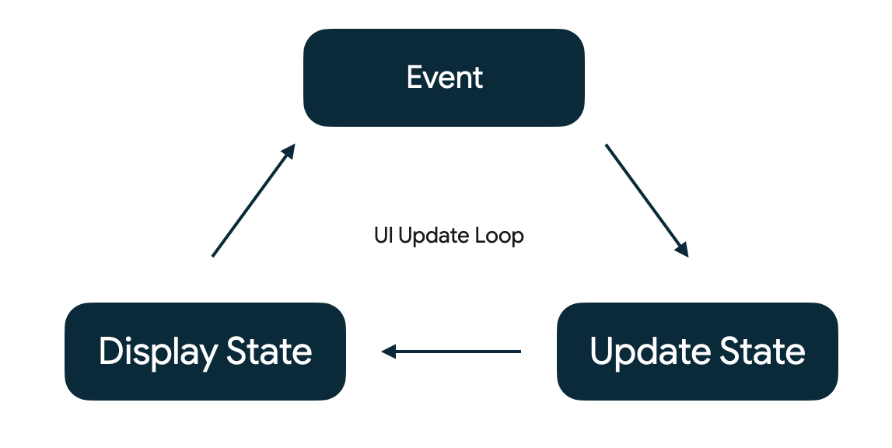
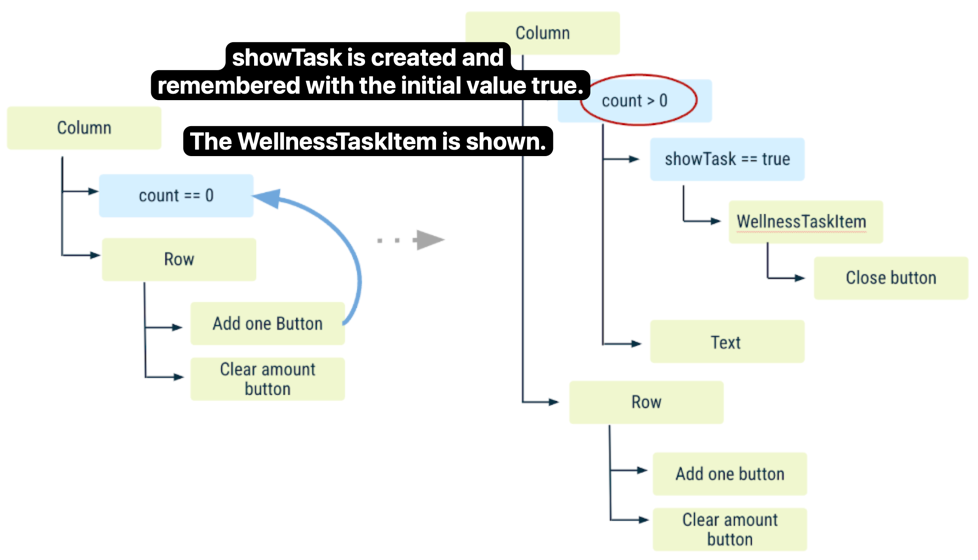
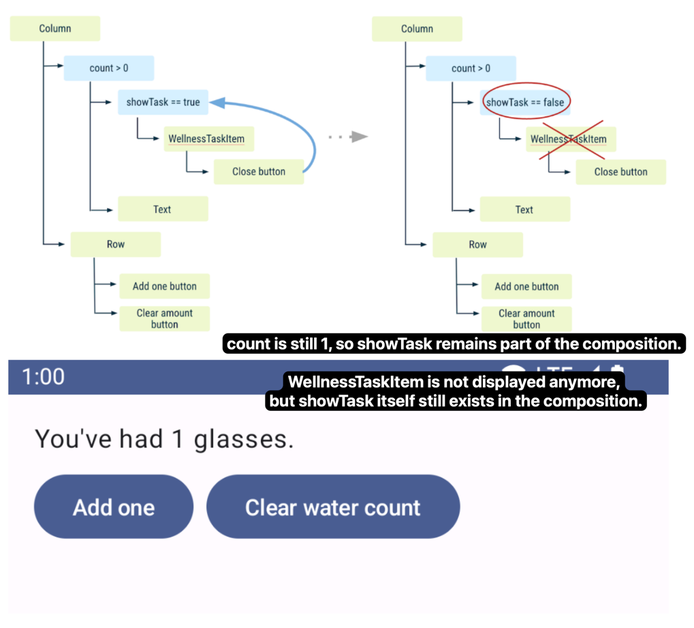
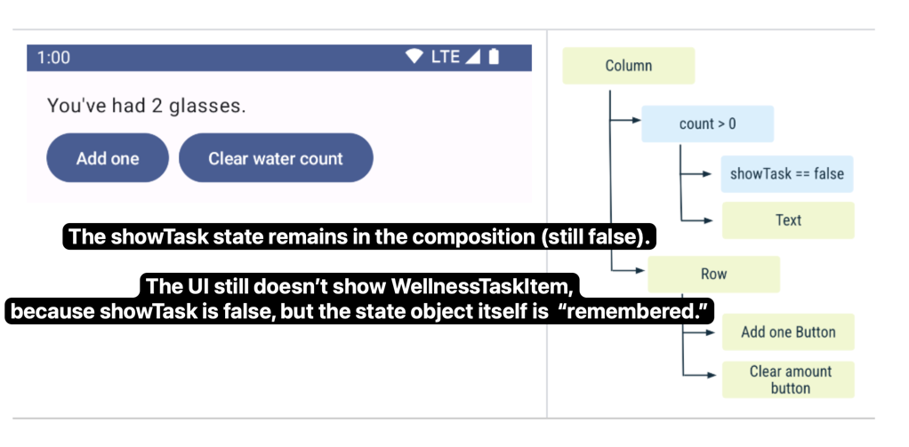
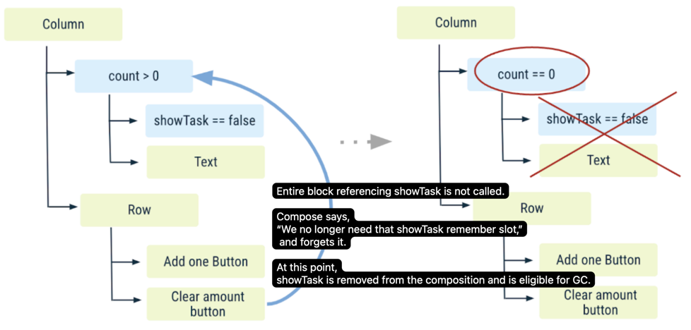
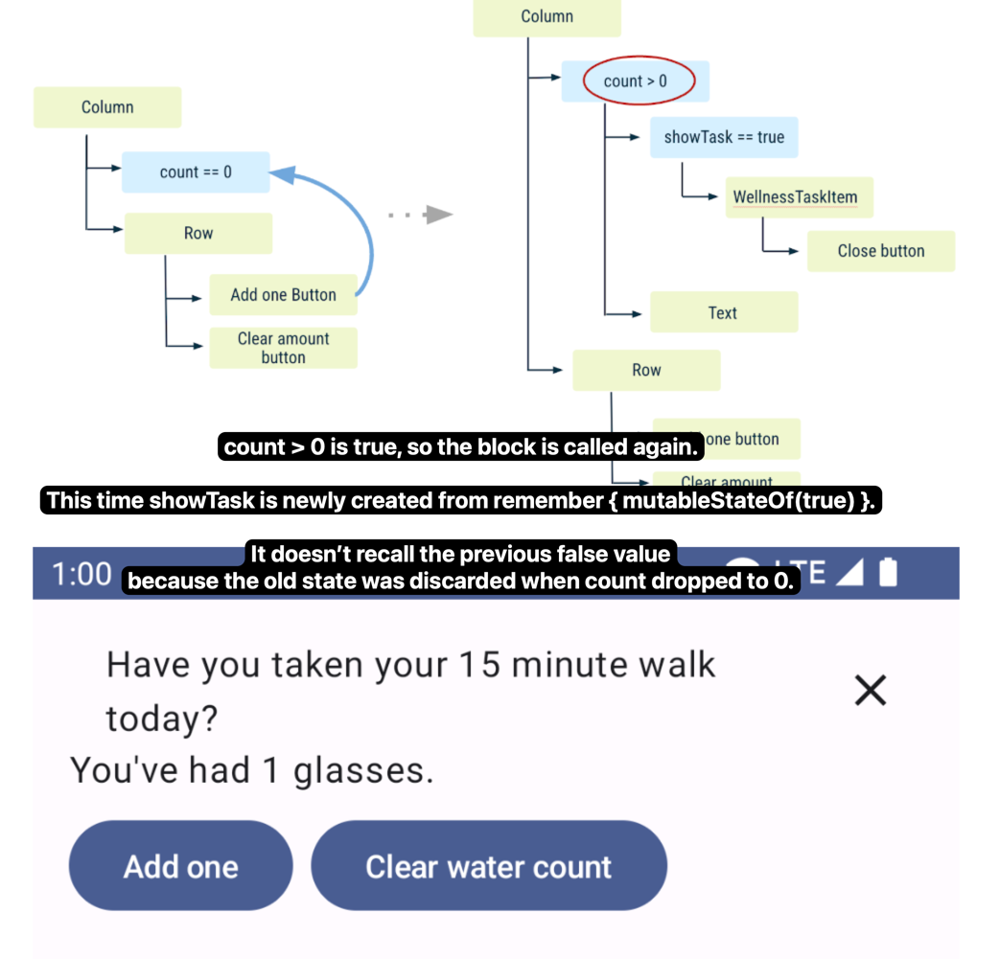

# study state in compose codelab

While the state of the app offers a description of what to display in the UI, events are the
mechanism through which the state changes, resulting in changes to the UI.

Key idea: State is. Events happen.

Events notify a part of a program that something has happened. In all Android apps, there's a core
UI update loop that goes like this:



## Mistake for trying to change state

```kotlin
import androidx.compose.material3.Button
import androidx.compose.foundation.layout.Column

@Composable
fun WaterCounter(modifier: Modifier = Modifier) {
    Column(modifier = modifier.padding(16.dp)) {
        var count = 0
        Text("You've had $count glasses.")
        Button(onClick = { count++ }, Modifier.padding(top = 8.dp)) {
            Text("Add one")
        }
    }
}
```

it doesn't work.

## Memory in a composable function

* The Composition: a description of the UI built by Jetpack Compose when it executes composables.
* Initial composition: creation of a Composition by running composables the first time.
* Recomposition: re-running composables to update the Composition when data changes.

Compose needs to know what state to track.

Compose has a special state tracking system in place that schedules recompositions for any
composables that read a particular state.
This lets Compose be granular and just recompose those composable functions that need to change, not
the whole UI.

You can use the mutableStateOf function to create an observable MutableState.
You can think of using remember as a mechanism to store a single object in the Composition, in the
same way a private val property does in an object.

## Remember in Composition

`remember` stores objects in the Composition,and forgets the object  
if the source location where remember is called is not invoked again during a recomposition.

check the [WaterCounterV2.kt](../WaterCounterV2.kt)

#### 1. Initial State


#### 2. Click Add one button




#### 3. Click task close IconButton



#### 4. Click Add one button



#### 5. Click clear water count button




#### 6. Click Add one button



## Restore state in Compose

Use `rememberSaveable` to restore your UI state after an Activity is recreated.  
Besides retaining state across recompositions,  
`rememberSaveable` also retains state across Activity recreation and system-initiated process death.


