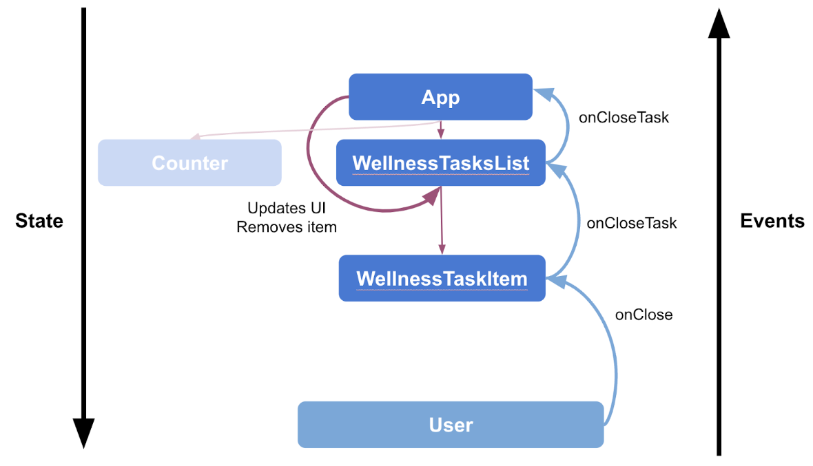

# study state in compose codelab

While the state of the app offers a description of what to display in the UI, events are the
mechanism through which the state changes, resulting in changes to the UI.

Key idea: State is. Events happen.

Events notify a part of a program that something has happened. In all Android apps, there's a core
UI update loop that goes like this:


## Mistake for trying to change state

```kotlin
import androidx.compose.material3.Button
import androidx.compose.foundation.layout.Column

@Composable
fun WaterCounter(modifier: Modifier = Modifier) {
    Column(modifier = modifier.padding(16.dp)) {
        var count = 0
        Text("You've had $count glasses.")
        Button(onClick = { count++ }, Modifier.padding(top = 8.dp)) {
            Text("Add one")
        }
    }
}
```

it doesn't work.

## Memory in a composable function

* The Composition: a description of the UI built by Jetpack Compose when it executes composables.
* Initial composition: creation of a Composition by running composables the first time.
* Recomposition: re-running composables to update the Composition when data changes.

Compose needs to know what state to track.

Compose has a special state tracking system in place that schedules recompositions for any
composables that read a particular state.
This lets Compose be granular and just recompose those composable functions that need to change, not
the whole UI.

You can use the mutableStateOf function to create an observable MutableState.
You can think of using remember as a mechanism to store a single object in the Composition, in the
same way a private val property does in an object.

## Remember in Composition

`remember` stores objects in the Composition,and forgets the object  
if the source location where remember is called is not invoked again during a recomposition.

check the [WaterCounterV2.kt](../WaterCounterV2.kt)

#### 1. Initial State


#### 2. Click Add one button


#### 3. Click task close IconButton


#### 4. Click Add one button


#### 5. Click clear water count button


#### 6. Click Add one button


## Restore state in Compose

Use `rememberSaveable` to restore your UI state after an Activity is recreated.  
Besides retaining state across recompositions,  
`rememberSaveable` also retains state across Activity recreation and system-initiated process death.

## State hoisting

A composable that uses remember to store an object contains internal state, which makes the
composable stateful.  
composables with internal state tend to be less reusable and harder to test.

Composables that don't hold any state are called stateless composables.  
An easy way to create a stateless composable is by using state hoisting.

The general pattern for state hoisting in Jetpack Compose is to replace the state variable with two
parameters:

* `value: T` - the current value to display
* `onValueChange: (T) -> Unit` - an event that requests the value to change with a new value T

where this value represents any state that could be modified.

The pattern where the state goes down, and events go up is called Unidirectional Data Flow (UDF),  
and state hoisting is how we implement this architecture in Compose.  
You can learn more about this in
the [Compose Architecture documentation](https://developer.android.com/develop/ui/compose/architecture#udf-compose).

State that is hoisted this way has some important properties:

* Single source of truth: By moving state instead of duplicating it, we're ensuring there's only one
  source of truth. This helps avoid bugs.
* Shareable: Hoisted state can be shared with multiple composables.
* Interceptable: Callers to the stateless composables can decide to ignore or modify events before
  changing the state.
* Decoupled: The state for a stateless composable function can be stored anywhere. For example, in a
  ViewModel.

### Stateful vs Stateless

A stateless composable is a composable that doesn't own any state, meaning it doesn't hold or define
or modify new state.

A stateful composable is a composable that owns a piece of state that can change over time.

In real apps, having a 100% stateless composable can be difficult to achieve depending on the
composable's responsibilities.    
You should design your composables in a way that they will own as little state as possible and allow
the state to be hoisted, when it makes sense, by exposing it in the composable's API.

[StatelessCounter.kt](../LiquidStatelessCounter.kt) , [StatefulCounter.kt](../WaterStatefulCounter.kt)

Key Point: When hoisting state, there are three rules to help you figure out where state should go:

State should be hoisted to at least the lowest common parent of all composables that use the state (
read).
State should be hoisted to at least the highest level it may be changed (write).
If two states change in response to the same events they should be hoisted to the same level.
You can hoist the state higher than these rules require, but if you don't hoist the state high
enough, it might be difficult or impossible to follow unidirectional data flow.

Your stateless composable can now be reused
like [LiquidStatefulCounter.kt](../LiquidStatefulCounter.kt).

If juiceCount is modified then StatefulCounter is recomposed. During recomposition, Compose
identifies which functions read juiceCount and triggers recomposition of only those functions.
When the user taps to increment juiceCount, StatefulCounter recomposes, and so does the
StatelessCounter that reads juiceCount. But the StatelessCounter that reads waterCount is not
recomposed.

Your stateful composable function can provide the same state to multiple composable functions.

```kotlin
@Composable
fun StatefulCounter() {
    var count by remember { mutableStateOf(0) }

    StatelessCounter(count, { count++ })
    AnotherStatelessMethod(count, { count *= 2 })
}
```

Because hoisted state can be shared, be sure to pass only the state that the composables need to
avoid unnecessary recompositions, and to increase reusability.

Key Point: A best practice for the design of Composables is to pass them only the parameters they
need.

https://developer.android.com/develop/ui/compose/state?hl=ko#state-hoisting

## Work with lists

[WellnessTaskItemV2.kt](../WellnessTaskItemV2.kt), [WellnessTask.kt](../WellnessTask.kt), [WellnessTasksList.kt](../WellnessTasksList.kt)

```kotlin
@Composable
fun WellnessScreen(modifier: Modifier = Modifier) {
    Column(modifier = modifier) {
        WaterStatefulCounter()
        WellnessTasksList()
    }
}
```

### Restore item state in LazyList

For WellnessTask When an item leaves the Composition, state that was remembered is forgotten.   
in [WellnessTasksList.kt](../WellnessTasksList.kt)
`list: List<WellnessTask> = remember { wellnessTasks() },`

How do you fix this? Once again, use rememberSaveable. Your state will survive the activity or
process recreation using the saved instance state mechanism. Thanks to how rememberSaveable works
together with the LazyList, your items are able to also survive leaving the Composition.

### Common patterns in Compose

```kotlin
@Composable
fun LazyColumn(
    modifier: Modifier = Modifier,
    state: LazyListState = rememberLazyListState(),
    contentPadding: PaddingValues = PaddingValues(0.dp),
    reverseLayout: Boolean = false,
    verticalArrangement: Arrangement.Vertical =
        if (!reverseLayout) Arrangement.Top else Arrangement.Bottom,
    horizontalAlignment: Alignment.Horizontal = Alignment.Start,
    flingBehavior: FlingBehavior = ScrollableDefaults.flingBehavior(),
    userScrollEnabled: Boolean = true,
    content: LazyListScope.() -> Unit
) {
    ...
}
```

```kotlin
    state: LazyListState = rememberLazyListState(),
```

The composable function rememberLazyListState creates an initial state for the list using
`rememberSaveable`. When the Activity is recreated, the scroll state is maintained without you
having to code anything.

Many apps need to react and listen to scroll position, item layout changes, and other events related
to the list's state. Lazy components, like LazyColumn or LazyRow, support this use case through
hoisting
the [LazyListState](https://developer.android.com/reference/kotlin/androidx/compose/foundation/lazy/LazyListState).
You can learn more about this pattern in the documentation for state in lists.

Having a state parameter with a default value provided by a public rememberX function is a common
pattern in built-in composable functions. Another example can be found
in [BottomSheetScaffold](https://developer.android.com/reference/kotlin/androidx/compose/material3/package-summary#BottomSheetScaffold(kotlin.Function1,androidx.compose.ui.Modifier,androidx.compose.material3.BottomSheetScaffoldState,androidx.compose.ui.unit.Dp,androidx.compose.ui.unit.Dp,androidx.compose.ui.graphics.Shape,androidx.compose.ui.graphics.Color,androidx.compose.ui.graphics.Color,androidx.compose.ui.unit.Dp,androidx.compose.ui.unit.Dp,kotlin.Function0,kotlin.Boolean,kotlin.Function0,kotlin.Function1,androidx.compose.ui.graphics.Color,androidx.compose.ui.graphics.Color,kotlin.Function1)),
which hoists state using `rememberBottomSheetScaffoldState`.

https://developer.android.com/develop/ui/compose/lists?hl=ko#react-to-scroll-position

## Observing MutableList

Using mutable objects for this, such as ArrayList<T> or mutableListOf, won't work.  
These types won't notify Compose that the items in the list have changed and schedule a
recomposition of the UI.  
You need a different API.

The mutableStateOf function returns an object of type MutableState<T>.

The mutableStateListOf and toMutableStateList functions return an object of type
SnapshotStateList<T>.

> Warning: You can use the mutableStateListOf API instead to create the list. However, the way you
> use it might result in unexpected recomposition and suboptimal UI performance.
> If you just define the list and then add the tasks in a different operation it would result in
> duplicated items being added for every recomposition.
> ```kotlin
> // Don't do this!
> val list = remember { mutableStateListOf<WellnessTask>() }
> list.addAll(getWellnessTasks())
> ```
> Instead, create the list with its initial value in a single operation and then pass it to the
> remember function, like this:
> ```kotlin
> // Do this instead. Don't need to copy
> val list = remember {
>     mutableStateListOf<WellnessTask>().apply { addAll(getWellnessTasks()) }
> }
> ```

The items method receives a key parameter.  
By default, each item's state is keyed against the position of the item in the list.

In a mutable list, this causes issues when the data set changes,  
since items that change position effectively lose any remembered state.



This error tells you that you need to provide
a [custom saver](https://developer.android.com/develop/ui/compose/state?hl=ko#restore-ui-state).  
However, you shouldn't be using rememberSaveable to store large amounts of data or complex data
structures that require lengthy serialization or deserialization.

Similar rules apply when working with Activity's onSaveInstanceState;
you can find more information in the Save UI states documentation.  
If you want to do this, you need an alternative storing mechanism.  
You can learn more
about [different options for preserving UI state](https://developer.android.com/topic/libraries/architecture/saving-states?hl=ko#options).

## State in ViewModel

The screen, or UI state, indicates what should display on the screen (for example, the list of
tasks).  
This state is usually connected with other layers of the hierarchy because it contains application
data.

ViewModels provide the UI state and access to the business logic located in other layers of the
app.  
Additionally, ViewModels survive configuration changes, so they have a longer lifetime than the
Composition.  
They can follow the lifecycle of the host of Compose content—that is,  
activities, fragments, or the destination of a Navigation graph if you're
using [Compose Navigation](https://developer.android.com/develop/ui/compose/navigation?hl=ko).

ViewModels are not part of the Composition. Therefore, you should not hold state created in
composables (for example, a remembered value) because this could cause memory leaks.

### Migrate the list and remove method

While the previous steps showed you how to manage the state directly in the Composable functions,
it's a good practice to keep the UI logic and business logic separated from the UI state and migrate
it to a ViewModel.

#### [WellnessViewModel.kt](../WellnessViewModel.kt)

Let's migrate the UI state, the list, to your ViewModel and also start extracting business logic into it.


#### [WellnessScreenV2.kt](../WellnessScreenV2.kt)

Instantiate the wellnessViewModel ViewModel by calling viewModel(), as parameter of the Screen composable, so it can be replaced when testing this composable, and hoisted if required. Provide WellnessTasksList with the task list and remove function to the onCloseTask lambda.

viewModel() returns an existing ViewModel or creates a new one in the given scope. The ViewModel instance is retained as long as the scope is alive. For example, if the composable is used in an activity, viewModel() returns the same instance until the activity is finished or the process is killed.

ViewModels are recommended to be used at screen-level composables, that is, close to a root composable called from an activity, fragment, or destination of a Navigation graph. ViewModels should never be passed down to other composables, instead you should pass only the data they need and functions that perform the required logic as parameters.


