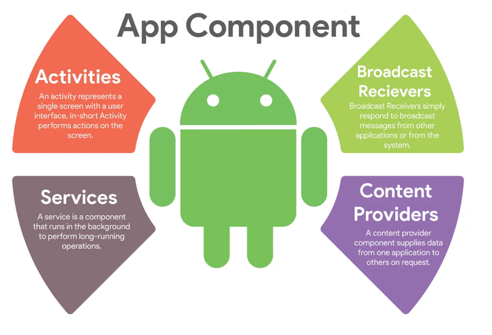

# 안드로이드 4대 구성요소

각 컴포넌트는 시스템이나 사용자가 앱에 진입할 수 있는 진입점이다.
일부 컴포넌트는 실행되기 위해서 다른 컴포넌트의 도움을 필요로 하는 경우가 있다.

* [Activities](activity/activity-eng.md)
    * 사용자 인터페이스가 있는 단일 화면을 나타낸다.
* Services
    * 다양한 이유로 어떤 작업을 백그라운드에서 계속 실행하기 위한 컴포넌트이다.
    * 사용자 인터페이스를 제공하지 않는다.
* BroadcastReceivers
    * 시스템 혹은 특정 앱은 외부에서 앱으로 이벤트를 전달할 수 있다.
    * 이 때 앱이 시스템 전체 브로드 캐스트 알림에 응답할 수 있도록하는 컴포넌트이다.
* ContentProvider
    * 앱의 데이터를 다른 앱과 공유할 수 있도록 해주는 컴포넌트.
    * 외부 앱이 안전하게 자신의 앱 데이터에 접근할 수 있도록 하는 것이 주 목적이다.
    * 다음 위치에 저장할 수 있는 공유 앱 데이터 집합을 관리한다.
        * 파일 시스템, 다른(혹은 같은) 앱의 SQLite 데이터베이스, 웹 or 앱이 액세스할 수 있는 기타 영구 저장소 위치

각 유형은 고유한 목적을 수행하며 고유한 생명 주기를 갖는다.

참고 자료:

* https://developer.android.com/guide/components/fundamentals

이미지: https://medium.com/@Abderraouf/understand-android-basics-part-1-application-activity-and-lifecycle-b559bb1e40e

