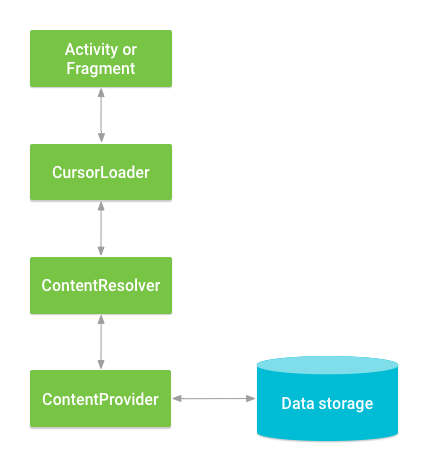

# Content Provider

앱의 데이터를 다른 앱과 안전하게 공유할 수 있도록 해주는 안드로이드 컴포넌트입니다.
`URI` 를 통해 데이터를 식별하고 `ContentResolver`를 통해 CRUD 작업을 수행합니다.
내부 DB 뿐만 아니라 파일, 네트워크 등 다양한 소스를 감싸는 일정의 데이터 인터페이스 역할을 합니다.

* `ContentProvider 작업 두 예시`
    * 다른 앱의 기존 `ContentProvider` 에 접근하기 위해 코드 구현
    * 다른 앱과 데이터를 공유하기 위해 앱에 새로운 `ContentProvider` 를 생성.

## ContentProvider와 ContentResolver의 상호작용

1. 앱 A (데이터 요청): `ContentResolver`를 사용하여 특정 URI에 대한 데이터 작업을 요청.
   예를 들어, 연락처 정보를 가져오거나 새로운 데이터를 저장하는 요청을 보낼 수 있다.
2. 안드로이드 시스템: `ContentResolver`는 요청된 URI를 분석하여 해당 URI를 처리할 수 있는 `ContentProvider`를 찾는다. (
   `PackageMaqnagerService` 가 탐색)
   이 정보는 각 앱의 `AndroidManifest.xml` 파일에 등록된 `ContentProvider` 정보를 통해 파악한다.
3. 앱 B (데이터 제공): 시스템은 찾은 `ContentProvider` (앱 B에 존재)에게 요청을 전달한다.
4. 앱 B (데이터 처리): `ContentProvider`는 요청에 따라 자신의 데이터를 조회, 삽입, 수정, 삭제하는 작업을 수행한다.
   예를 들어, 데이터베이스에서 정보를 읽어오거나 새로운 정보를 저장한다.
5. 앱 B (결과 반환): `ContentProvider`는 처리 결과를 다시 안드로이드 시스템을 통해 `ContentResolver`에게 전달한다.
6. 앱 A (결과 수신): `ContentResolver`는 받은 결과를 앱 A에게 반환한다. 앱 A는 이 결과를 사용하여 화면에 표시하거나 다른 작업을 수행한다.

## CursorLoader

`ContentProvider` 에서 데이터를 비동기적으로 로드하고,
데이터 변경 시 자동으로 UI 를 업데이트하는데 사용되는 클래스입니다.
`Activity` 나 `Fragment`의 생명 주기를 인식하여 효율적인 데이터 관리를 돕습니다.

`CursorLoader`는 `ContentProvider`에서 데이터를 비동기적으로 로드하고,
데이터 변경 시 자동으로 UI를 업데이트하는 데 사용되는 클래스이다.
`Loader` API의 일부이며, `Activity`나 `Fragment`의 생명주기를 인식하여 효율적인 데이터 관리를 돕는다.

### CursorLoader의 주요 특징 및 장점

1. 비동기 로딩: `ContentProvider` 로부터 데이터를 가져오는 작업을 백그라운드 스레드에서 수행합니다.
   이를 통해서 UI 스레드가 차단되는 것을 방지하여 앱의 응답성을 유지합니다.
2. 생명주기 관리: `Activity` 또는 `Fragment`의 생명주기와 통합되어
   컴포넌트가 활성 상태일 때만 데이터를 로드하고,
   비활성 상태가 되면 자동으로 로더를 중지하거나 리소스를 해제합니다.
3. 자동 업데이트: `ContentProvider`의 데이터가 변경되면
   `CursorLoader`는 자동으로 새로운 데이터를 다시 로드하고 UI 에 반영합니다.
   (`ContentObserver`를 통해)
   개발자가 직접 데이터 변경을 감지하고 UI 를 갱신하는 코드를 작성할 필요가 없습니다.

> 여러 앱/프로세스에서 자원에 접근할 경우는??
> `ContentProvider`는 Binder IPC 로 다른 앱에서 접근할 수 있습니다.
> 시스템은 IPC 를 통해 들어온 요청들을 AMS(`ActivityManagerService`),
> `ContentProviderService` 등을 거쳐서 직렬화된 방식으로 처리하여 충돌을 방지합니다.

## Contracts 에 접근하는 ContentProvider 예시

다른 앱(여기서는 디바이스 기본 앱인 연락처 앱)의 `ContentProvider` 에 접근하여 데이터를 가져오는 경우입니다.

앱은 연락처 데이터의 URI 와 필요한 권한을 알고 있어야 합니다.
데이터 제공자(연락처 앱)는 `ContentProvider` 를 통해 데이터를 외부에 공개하고, 접근 권한을 설정합니다.
이를 통해서 앱은 직접 DB 에 접근하는 코드를 작성하지 않고도 안전하게 데이터를 공유받을 수 있습니다.

### ContractsActivity

| 항목          | 설명                                                     |
|-------------|--------------------------------------------------------|
| 대상 URI      | `ContactsContract.Contacts.CONTENT_URI`                |
| Provider 위치 | Android 시스템 앱 (`com.android.providers.contacts`)       |
| 접근 권한       | `android:exported="true"` (시스템이 공개한 `ContentProvider`) |
| 권한 필요       | ✅ `android.permission.READ_CONTACTS`                   |
| 코드 제어       | ❌ 내부 동작은 Android 시스템이 처리 (query만 가능, DB 구조 몰라도 됨)      |
| 목적          | 시스템 자원 활용 (연락처, 캘린더, 사진 등)                             |

## 직접 만든 DB 에 접근하는 Shipment 예시

앱이 자체적으로 `ContentProvider` 를 구현하여 내부 데이터를 다른 앱과 공유하거나,
앱 내부의 다른 모듈과 데이터를 주고 받는 경우입니다.

이 경우:

1. 앱 개발자는 `ContentProvider`를 직접 만들고,
2. 데이터에 접근할 수 있는 URI를 정의하며,
3. 필요한 경우 접근 권한도 설정합니다.

이를 통해 앱은 자신의 데이터를 체계적으로 관리하고, 필요에 따라 다른 컴포넌트와 안전하게 공유할  수 있습니다.

| 항목          | 설명                                                             |
|-------------|----------------------------------------------------------------|
| 대상 URI      | `content://com.m3mobile.shipment.provider/shipments` (앱 내부 정의) |
| Provider 위치 | 직접 만든 `ShipmentContentProvider`                                |
| 접근 권한       | `android:exported="false"` → 앱 내부에서만 접근 가능                     |
| 권한 필요       | ❌ 없음                                                           |
| 코드 제어       | ✅ 모든 동작(DB, insert, delete, query 등)을 앱 내부에서 완전히 제어            |

### ShipmentContentProvider

* `AUTORITY`: 이 `ContentProvider`의 고유 식별자. 외부 앱은 이 이름을 사용해 접근.
* `CONTENT_URI`: 데이터를 조회할 때 사용할 기본 URI 경로 (shipments 테이블 전체)
* `UriMatcher`: 요청된 URI가 어떤 타입인지 구분해주는 역할 (목록 조회 or 단일 항목 조회)
* 주요 메서드
    * `onCreate`
    * `query`: uriMatcher.match(uri)로 URI 형태 구분
    * `insert`: values에 담긴 데이터를 DB에 저장하고, 생성된 row의 URI를 반환
    * `update`: values에 담긴 데이터를 DB에 저장하고, 생성된 row의 URI를 반환.
    * `delete`: 주어진 조건에 맞는 row들을 삭제하고 삭제된 row 수 반환
    * `getType`: 주어진 URI에 해당하는 MIME 타입 반환

> MIME 타입은 Multipurpose Internet Mail Extensions type
> 문서, 파일 또는 바이트 스트림의 성격과 형식을 나타내는 표준화된 방식입니다.
> 쉽게 말해, "이 데이터는 어떤 종류의 데이터인가?"를 알려주는 식별자라고 생각할 수 있습니다.
> 원래는 이메일 시스템에서 다양한 형식의 파일을 첨부하기 위해 개발되었습니다.
> 하지만 현재는 인터넷 전반, 특히 웹(HTTP)에서 널리 사용됩니다.
> `type/subtype` 으로 구분됩니다. ex: `text/plain`, `image/jpeg`, `application/json`

### ShipmentDbHelper

커스텀 ContentProvider는 “앱 간 연동” 또는 “플러그인 시스템”처럼 내부 데이터 공유에 적합

* SQLiteOpenHelper를 상속받는 헬퍼 클래스.
* 내부 SQLite 데이터베이스인 "shipment.db"를 생성/관리하는 역할.
* null은 기본 커서 팩토리 사용.
* 1은 데이터베이스 버전 (업그레이드 시 변경됨).

* `onCreate()`에서 db 생성
* `onUpgrade()`에서 db 삭제 후 재생성(실제로는 기존 데이터를 보전해야 하지만, ContentProvider 에 집중하기 위해 생략.)

| 컬럼명         | 타입      | 설명          |
|-------------|---------|-------------|
| _id         | INTEGER | 기본 키, 자동 증가 |
| item_name   | TEXT    | 품목 이름 (필수)  |
| quantity    | INTEGER | 수량 (필수)     |
| destination | TEXT    | 목적지 (선택)    |
| timestamp   | INTEGER | 출고 등록 시간    |

